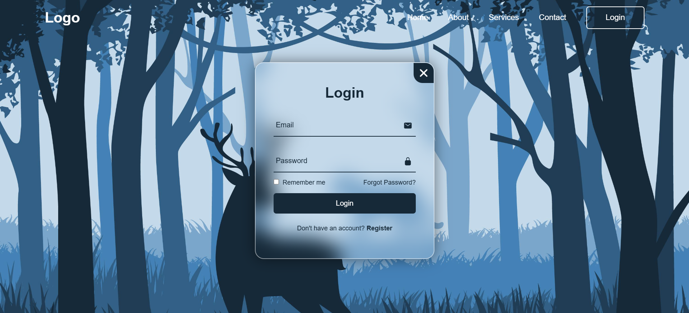
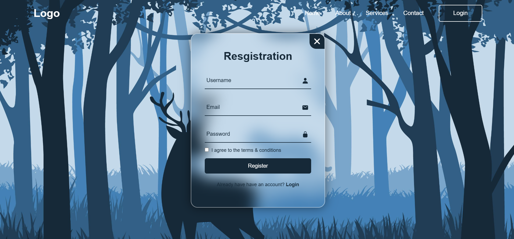

# OIBSIP_WebDevelopment_Task4
Task 4 of level 2 under Oasis Infobyte Internship Program
[Login Authentication]

## Objective
Create a simple login authentication system using HTML, CSS, and JavaScript that allows users to register, log in, and access a secured page using frontend validation .

##  Tools Used
- HTML5
- CSS3
- JavaScript (Vanilla)
- Visual Studio Code

## Steps Performed
1. Designed responsive **login** and **register** forms using HTML and CSS.
2. Created a card-style layout with smooth transitions between forms.
3. Used JavaScript to:
   - Switch between login and register forms
   - Perform basic input validation (username/password fields)
   - Display success/failure messages using alerts or styled elements
4. Added a secure area message once the user logs in correctly (simulated frontend-only access).
5. Styled the background and form container for a clean user interface.

## Outcome
A visually appealing, frontend-only login authentication system that:
- Lets users switch between login and register forms
- Validates input fields
- Simulates authentication with styled feedback
- Demonstrates the basics of UI interaction without backend
  
## Screenshot

## Demo Video:
👉 [Click here to watch the demo on YouTube](https://www.youtube.com/watch?v=449w0-qHoZg)

